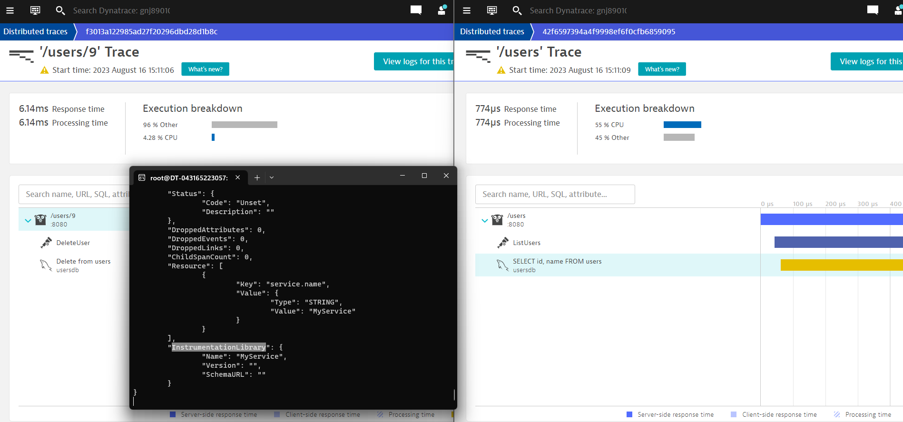

# Demo OpenTelemetry con Go 1.16 y Dynatrace Integration

Este repositorio contiene una aplicación de demostración en Go versión 1.16 que utiliza OpenTelemetry versión 1.10.

## Prerrequisitos

- Docker y Docker Compose.
- Git.
- Postman (para probar los endpoints).

## Cómo comenzar

1. **Clonar el repositorio:**
   ```bash
   git clone https://github.com/Edunzz/demo_otel_goland_dt_integration.git
   ```

3. **Navega al directorio clonado:**
   ```bash
   cd demo_otel_goland_dt_integration/app_go
   ```

4. **Levantar el servicio usando Docker Compose:**
   ```bash
   docker-compose up -d
   ```

## Instalar Dynatrace Oneagent

Para tener el monitoreo Dynatrace se requiere instalar Oneagent siguiendo los pasos indicados en el deploy dynatrace.

## Uso con Postman para generar tráfico

Puedes encontrar un archivo `postman.json` en este repositorio que contiene los endpoints preparados para hacer requests al servicio y generar tráfico.

- **Listar Usuarios**: Método `GET` en `[Tu URL]/users`.
- **Crear Usuario**: Método `POST` con un payload JSON `{"name": "NombreDelUsuario"}` en `[Tu URL]/users`.
- **Eliminar Usuario**: Método `DELETE` en `[Tu URL]/users/{id}`. Reemplaza `{id}` con el ID del usuario que deseas eliminar.

## Instrumentación OpenTelemetry

La instrumentación se realiza a través de la librería OpenTelemetry. Cada endpoint tiene un segmento de código que inicia y finaliza un "span" para rastrear el tiempo de ejecución del endpoint.

Por ejemplo, en el endpoint `ListUsers`, tenemos:

```go
_, span := tracer.Start(c.Request.Context(), "ListUsers")
defer span.End()
```

Este patrón se sigue en todos los endpoints.

Los detalles de configuración e inicialización del rastreo se encuentran en las funciones `setupTelemetry`, `newExporter` y `newTraceProvider` del main.go.

No se realiza un exporte directo de los spans. En su lugar, estos son recolectados y gestionados por Dynatrace OneAgent, que integra y visualiza las trazas y spans en su tecnología patentada llamada PurePath.



## Nota Importante

Este demo está específicamente diseñado para trabajar con Dynatrace OneAgent. Asegúrate de tener OneAgent configurado y ejecutándose para visualizar los datos correctamente.
